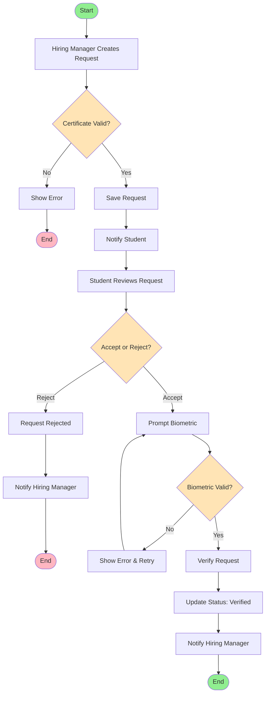
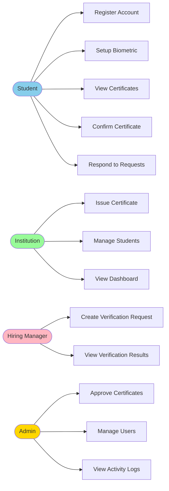
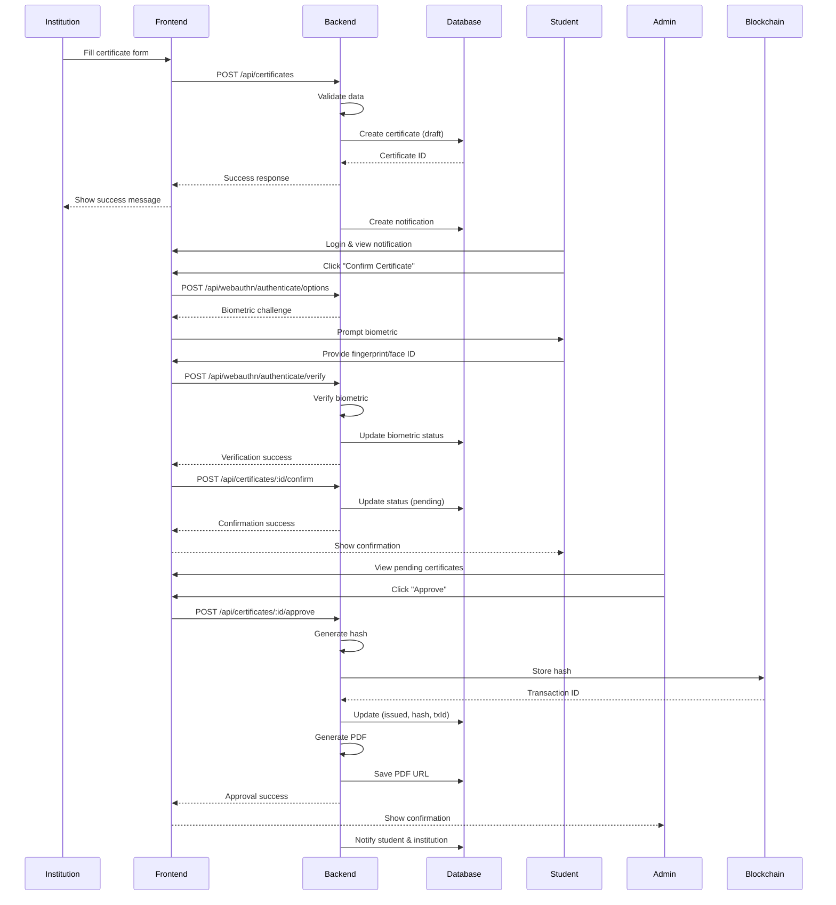
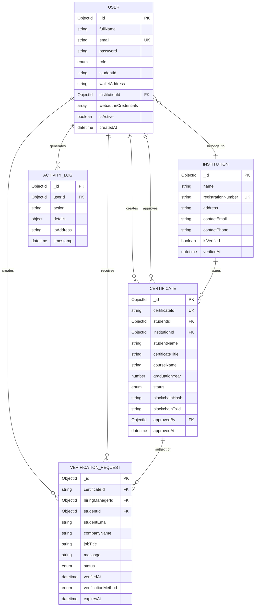
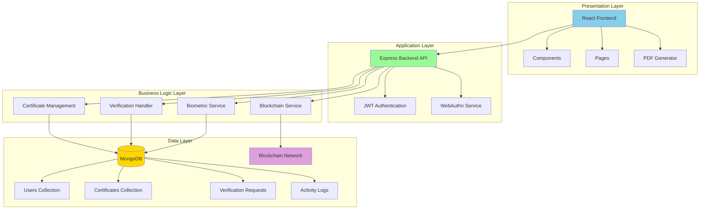
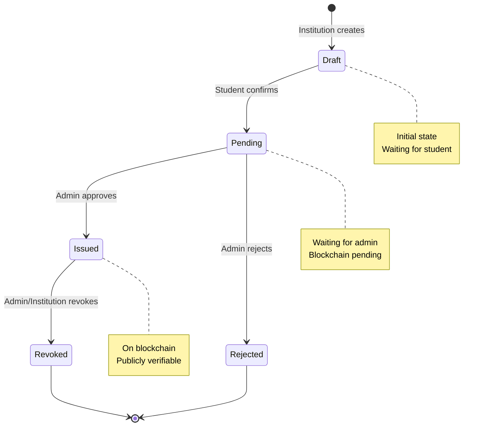

# 🎨 Ready-to-Use Mermaid Diagrams

Copy these directly into any Mermaid-compatible tool or markdown renderer.

## 1. Simple Flowchart - Certificate Verification Request

## 2. Use Case Diagram

## 3. Sequence Diagram - Certificate Issuance

## 4. Entity Relationship Diagram

## 5. System Architecture Diagram

## 6. State Diagram - Certificate Status

## How to Use These Diagrams

### Option 1: GitHub Markdown
Just paste the code into your README.md or any .md file on GitHub. It will render automatically!

### Option 2: Mermaid Live Editor
1. Go to https://mermaid.live
2. Paste any diagram code
3. Edit and export as PNG/SVG

### Option 3: VS Code
1. Install "Markdown Preview Mermaid Support" extension
2. Open any .md file with Mermaid code
3. Preview will show the diagram

### Option 4: Draw.io
1. Go to draw.io
2. Arrange → Insert → Advanced → Mermaid
3. Paste the code

---

**These diagrams are ready to use and can be easily modified!**
